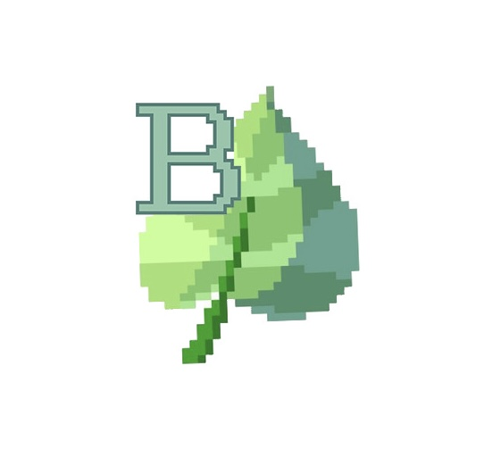
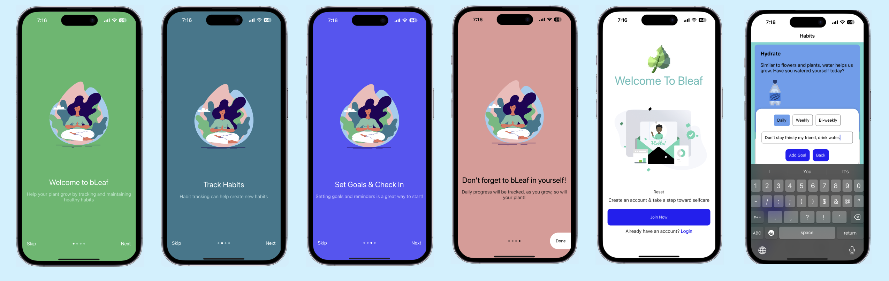
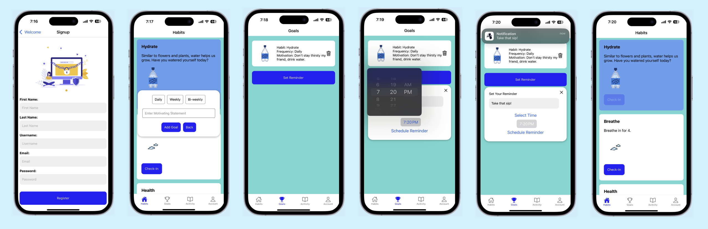
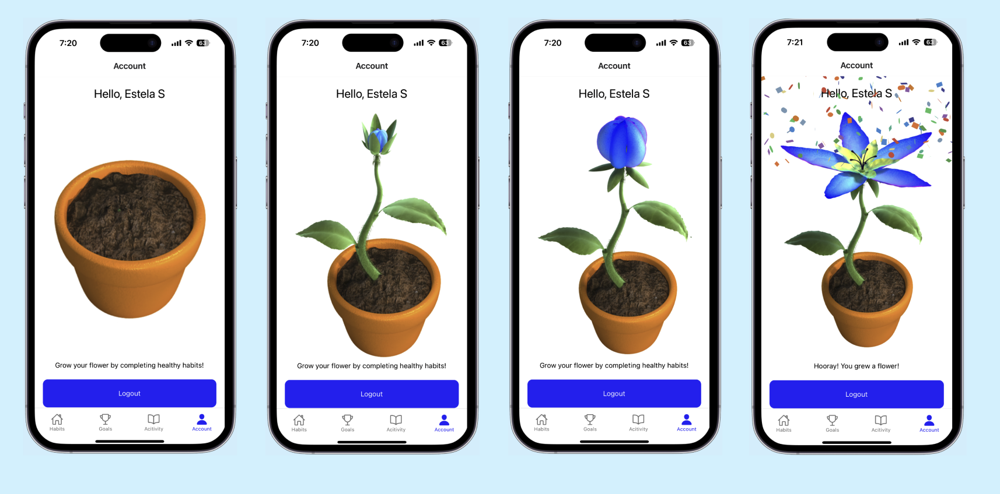

# B.Leaf
<p align="center">
 
</p>

<h2 align="center">bLeaf</h2>


# About
BLeaf makes self-care easy by giving users the support they need to meet their personal care goals. This app allows users to keep track of their personal care activities throughout the day and gives them the option to set up reminders, guilt and pressure free. While finding time to set goals and sticking to healthy habits can be difficult, it is extremely helpful to a person's well-being. Self-care can help manage stress, lower the risk of illness, increase energy, and elevate moods. This is why BLeaf rewards positive habits day-by-day rather ever promoting shame in a user for not always meeting their goals. A flower pot is provided to each user upon creating an account. In exchange for completing healthy habits, the user will see their flower grow. BLeaf celebrates even the small victories, aiming to help users bLeaf in themselves. 

<br/>
<p align="center"></p>
<br/>
<p align="center"></p>
<br/>
<p align="center"></p>
<br/>


## Getting Started

1. Clone the repository:

```
git clone https://github.com/CapstoneBLeaf/BLeaf
cd client
```

2. Download ExpoGo on your iOS device

3. Install dependencies:
   ```
   npm install
   ```
4. Start expo to run simulator:
   ```
   npx expo start
   ```
5. Use device to scan QR Code
   ```
   
   
   ```
6. If there is an internet connectivity [ERROR] run: 
   ```
   1. npm i -g @expo/ngrok
   2. npx expo start --tunnel 
   
   ```
## Built Using

<a href="https://developer.mozilla.org/en-US/docs/Web/JavaScript" title="JavaScript"></a> Javascript  
<a href="https://nodejs.org/" title="Node.js"></a> Node.js  
<a href="https://expo.dev/" style="text-decoration:none" title="Expo">:iphone:</a> Expo  
<a href="https://reactnative.dev/" title="ReactNative"></a> React Native  
<a href="https://www.npmjs.com/" title="npm"></a> NPM

## Contributors

Tanvi Patel

#### :octocat: <a href="https://github.com/tanvi4248">GitHub</a>

#### :link: <a href="https://www.linkedin.com/in/tdhpatel/">LinkedIn</a>

Trina McGee

#### :octocat: <a href="https://github.com/LFTHVY55">GitHub</a>

#### :link: <a href="https://www.linkedin.com/in/trina-mcgee/">LinkedIn</a>

Dylan Wicker

#### :octocat: <a href="https://github.com/pardoner">GitHub</a>

#### :link: <a href="https://www.linkedin.com/in/dylanwicker/">LinkedIn</a>

Estela Sharp

#### :octocat: <a href="https://github.com/estelasharp">GitHub</a>

#### :link: <a href="https://www.linkedin.com/in/estela-sharp-95697010b/">LinkedIn</a>

